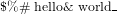
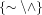
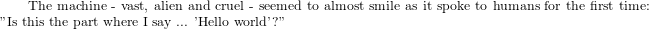
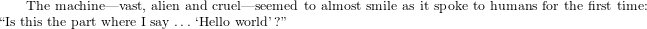

> ## Learning Objectives {.objectives}
>
> * Understand that LaTeX is a layer on top of the TeX programming language.
> * Know how to generate and compile a simple TeX document.
> * Be able to identify and use control words and control symbols.
> * Recognise and escape special characters in a LaTeX document.
> * Understand the difference between mutton and nuts.

The simplest way to approach LaTeX is to begin with TeX instead.
We'll have a look at a few different ways to generate a minimal TeX document.

Most of the time you won't be directly dealing with this low-level stuff,
but a brief exposure now will help you understand and appreciate LaTeX a bit better in the following lessons.

Let's create our first TeX file by entering the following command exactly:

~~~ {.bash}
$ echo 'hello world\end' > hello.tex
~~~

Verify that we entered it correctly:

~~~ {.bash}
$ cat hello.tex
~~~
~~~ {.tex}
hello world\end
~~~

Now fire up the TeX compiler:

~~~ {.bash}
$ pdftex
~~~

Its response looks a bit unwelcoming,
just a bit of version information and then two asterices to prompt for input:

~~~ {.output}
This is pdfTeX, Version 3.14159265-2.6-1.40.15 (TeX Live 2014/Arch Linux)
(preloaded format=pdftex)
 restricted \write18 enabled.
**
~~~

At the prompt, type in the name of the file you just made and press enter:

~~~
**hello
~~~

It will now generate a PDF called `hello.pdf`.
You should open it and have a look; the result will look a bit like this:

At this point, you probably notice that `\end` didn't make it into the PDF output.
It's no coincidence that this word also begins with a backslash.
When we wrote `\end`, we entered a TeX *control word*.
A lot of being able to use LaTeX is just knowing different control words.
The `\end` control word is fairly self-explanatory,
it told `pdftex` that this is the end of the input so now generate the pdf.

> ## Which Compiler? {.callout}
>
> In this lesson we use `pdftex` to compile TeX into PDFs.
> In fact, there is also a `tex` command that generates DVI (device independent) output.
> We choose `pdftex` primarily because not all document viewers are able to display DVI files,
> but also because these days it is a standard format no longer heavily encumbered by Adobe copyright and patents.
>
> Generating DVI output still has some uses, though.
> In particular, it is easy to convert DVI files to other image formats such as SVG and PNG.

Rather than waiting for `pdftex` to prompt us for the file name,
we could also have called it like so:

~~~ {.bash}
$ pdftex hello
~~~

Finally, we can use pdftex without even having a pre-existing file.
Run `pdftex` again without any arguments:

~~~ {.bash}
$ pdftex
~~~

Now when you get to the prompt, instead of entering a file name,
we can enter a new control word which tells `pdftex`
"we just want to write some things here directly":

~~~ {.tex}
**\relax
~~~

This will change the prompt to just a single asterix.
At this new prompt, put in the same content as before:

~~~ {.tex}
*hello world\end
~~~

When you press enter, a PDF will once again be generated.
There is a small difference this time though.
Since we didn't tell `pdftex` the name of the file,
it has to guess a suitable name for the output,
so instead of generating `hello.pdf`, it generates `texput.pdf`.

We've looked at *control words*, which always take the form of a backslash followed by some alphabetic characters.
There is one other type of control sequence you'll need to know about,
which is the *control symbol*.

Open `hello.tex` in your preferred text editor, for example by running:

~~~ {.bash}
$ nano hello.tex
~~~

Now edit it to add a `\"` in front of the first "o" and a `\`` in front of the
second "o":

~~~ {.tex}
hell\"o w\`orld\end
~~~

Recompile in the usual way.
Viewing the result in your PDF viewer should look a bit like:

Control symbols always consist of a backslash followed by exactly one non-alphabetic character.
There are lots of types of control symbols, but most of the time you only need
to know about the ones that modify the following letter.

> ## Which Editor? {.callout}
>
> When we talk about "text editors" such as Nano, we really do mean *text*.
> They are only meant to work with plain character data, not tables, images, or any other media.
> 
> Although this might seem like a restriction,
> there is a reason word processors are unsuited to working with programming source code.
> Word processors add a lot of extra hidden information about formatting and document structure.
> The programmer has little control over this hidden information,
> and it will always confuse `pdftex` or any other compiler you use.
>
> We use Nano in examples because it always displays available commands.
> This allows anyone to use it without training.
> However, keep in mind that it is unsuitable for *real* work.
> It lacks a lot of features that are important when trying to do anything serious with text or source code.
>
> On Unix systems (such as Linux, Mac OS X, and FreeBSD), many programmers use
> [Emacs](http://www.gnu.org/software/emacs/) or [Vim](http://www.vim.org/).
> These require some training and experience to use effectively,
> but they are stable, have a lot of powerful features.
> and are available in all computing environments.
> If your career is going to involve a lot of computation,
> especially in high-performance environments and servers,
> you should consider investing the time to learn either Vim or Emacs.
>
> On the other hand,
> if you're in a graphical environment and want to see clickable buttons and menus,
> you might prefer an editor such as [Gedit](http://projects.gnome.org/gedit/),
> [Kate](http://www.kde.org/applications/utilities/kate/),
> or [Notepad++](http://notepad-plus-plus.org/).

> ## Hello world {.challenge}
> 
> Make sure you can compile the examples we've looked at so far, using multiple compilation methods.
>
>
> ## More control symbols {.challenge}
>
> Try adding control symbols in front of each of the other letters in your document.
> Also try experimenting with other control symbols such as `\'`.
> 
> Note: if you enter something the compiler doesn't know how to deal with,
> it will halt and prompt you with a question mark to tell it how to proceed.
> If you want to cancel and quit the compiler, enter the letter "X" after the "?" and press enter.
>
> 
> ## More control words {.challenge}
>
> What do you think will happen if you compile the following documents?
> 
> ~~~ {.tex}
> hello world\end\end
> ~~~
>
> ~~~ {.tex}
> hello world\relax\end
> ~~~
>
> ~~~ {.tex}
> \relaxhello world\end
> ~~~
> 
> ~~~ {.tex}
> \end hello world\end
> ~~~

We've seen that the backslash character "\" is used to start control sequences.
There are also some other characters that have special meanings in a TeX or LaTeX document.
We'll learn about some of these in later lessons,
but for the moment you should at least be aware that they are special.

If you want to display special characters in a document you'll need to take one or two extra steps.
If you use them incorrectly,
you'll either get an error if you're lucky,
or unexpected results otherwise.

The characters to be careful of are curly brackets ({, }),
dollar signs ($), ampersands (&), hashes (#), carets (^), underscores (_), 
tildes (~), and percent signs (%).

The characters `$ % # & _` are straightforward to deal with.
You can tell LaTeX to print them as-is by putting a backslash in front of them, like so:

~~~ {.tex}
\$\%\# hello\& world\_\end
~~~

This use of a backslash to convert a special character to a printing character is called "escaping".
It is also possible to escape the tilde and the caret,
but this turns them into control symbols,
so they need *unescaped* curly brackets straight after them.
This tells them to act on an "empty" letter instead of the next printed letter:

~~~ {.tex}
\^h\~ello\~{}\^{}world\end
~~~

Escaping the tilde or the caret in this way often doesn't look right.
For example, when displaying a web address with a tilde in it,
you will usually want the tilde to look lower and wider.
To achieve this requires using a combination of control words and LaTeX's "mathematics mode".
We'll look more at mathematics mode in another lesson,
but we can have a first glimpse here.

~~~ {.tex}
$\{\sim \backslash \wedge\}$\end
~~~

There are couple of things to notice here.
First of all, we now see why the dollar sign is a special symbol.
It is used to start and stop mathematics mode.
Secondly, look at how `\sim` and `\wedge` give much better looking symbols than the previous tilde and caret.

One final thing, although they don't exactly involve special symbols,
there are certain other aspects of LaTeX typography that
require a little special treatment.
These are quotation marks, dashes and elipses (i.e. "...").

Consider the following document, and then observe the output it produces:

~~~ {.tex}
The machine - vast, alien and cruel - seemed to almost
smile as it spoke to humans for the first time:
"Is this the part where I say ... 'Hello world'?"\end
~~~

Some of the quotation marks are around the wrong way,
the dashes are too small,
and the ellipses are too tightly clustered.

Have a look at the difference when it's done correctly:

~~~ {.tex}
The machine---vast, alien and cruel---seemed to almost
smile as it spoke to humans for the first time:
``Is this the part where I say $\ldots$ `Hello world'?''\end
~~~

In other words, to generate quotation marks correctly, we need to use a
combination of backticks (\`) and apostrophes ('),
and entering an ellipses requires entering math mode and invoking the `\ldots` command word.
This is arguably annoying but it will become second nature when you begin using LaTeX regularly.

The treatment of dashes, on the other hand, does have some logic behind it.
In correct typography, there are actually four types of dashes that we might want to display:

* The hyphen: used for compound words like "daughter-in-law";
* The minus sign: the mathematical symbol for subtraction;
* The en-dash: also called a "nut", has the same width as the letter "n", used for ranges of numbers and dates;
* The em-dash: also called "mutton", has the same width as the letter "m", used to punctuate sentences in various ways.

In LaTeX, the minus sign appears if and only if you are in math mode.
Hyphens, nuts and mutton are entered using "-", "--" and "---" respectively.

> ## Escapism {.challenge}
>
> See whether you can generate something like the following output:

